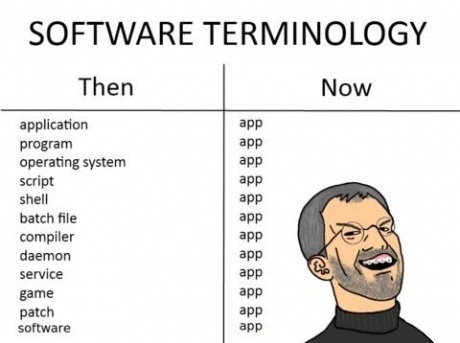
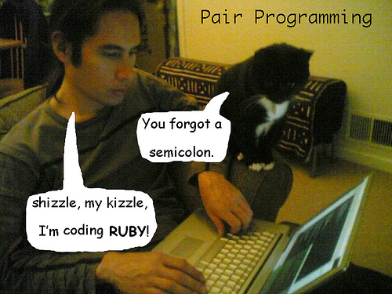
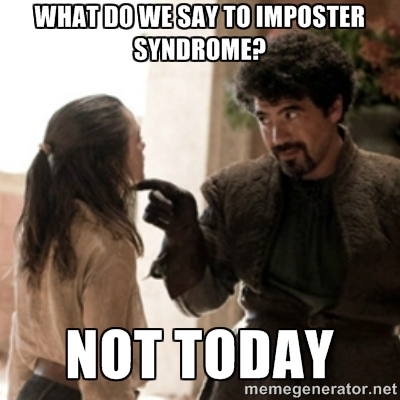
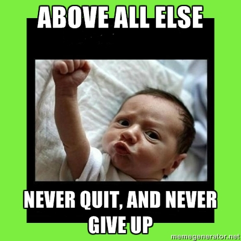

## Guide du voyageur en terre simplonienne

---
Comment travailler à Simplon

Qui est ce fameux esprit Simplon ?
___

  Chez les developpeurs
---

#### Une école qui propose des formations intensives de six mois
---

Vous aller manger de l'écran 

Tous les jours !

8h par jour !
---

Formation intense : qui pourri vos yeux, vous porterez des lunettes un jour où l'autre !
---

#### Simplon vous apprend à apprendre

---

 * Simplon hacke les écoles d'ingénieurs
 * Mais le métier de développeur logiciel demande 5 ans d'apprentissage (en alternance)

---

Skills, not diplomas

but tons of work to achieve

---

#### La formation sera orienté projet

---

Vous travaillerez en équipe à réaliser un projet interne ou professionnel.

Mais dans 2 mois environ

---

Learning by doing

---

#### Vous monterez en puissance grâce à vos projets

---

Une évolution par pallier

1. projet perso
2. projet interne en groupe
3. projet professionnel en équipe

Auto-évaluation pendant entretiens individuels

---

Ceux déjà au pallier 2 devront aider (aka recruter dans leur groupe), ceux qui n'ont pas encore passé ce pallier.

---

#### Simplon est une formation pour apprendre à créer des sites web et des applications web/mobile

---

---

#### Le codage est ouvert à tous

---

Beaucoup de gens veulent apprendre le **développement logiciel**, mais ce n'est pas pour tout lele monde.

---
:computer:

Soyez employable à la fin de la formation, mais le chemin est très long avant de devenir développeur

 Teach Yourself Programming in Ten Years 

*by Peter Norvig* 

---

#### Ayez l'esprit hacker : curieux et persévérant

---

Cycle du developpeur :

* rester bloqué, 
* chercher la solution,
* trouver la solution,
* hurler de joie,
* déchanter dans 3sec qui suivent devant le problème d'après. 
---

---

#### Une méthode pédagogique innovante

---

La classe inversée
---

La journée

---

Le soir

---

#### La formation sera basée sur l'autonomie des élèves.
---

 * Ni diplome, ni syllabus, ni polycopiés, 
 * Pas même de classe, ni pause café de 10h à 10h10
 * Facilitateur présent pour aider
 * mais vous serez autonome dans votre apprentissage

---

Read the Fucking Manual
---

#### Une journée basée sur des présentations et des binomes autonomes

***

* Activité autonome 
* Activité quotidienne de groupe 
* Activité périodique
* Activité exceptionnelle

---
#### Activité quotidienne de groupe

ex. Session de dojos

+ Avec El_roro
+ ''
+ apprendre avec moi (Uknow)

---
#### Activité périodique

+ Hackathon interne : un/mois, sur une journée (samedi?) liste feature bien définit TDD en pair
+ Entretien individuel
+ Retrospective agile : une matinée toutes les deux semaines 

---
#### Activité exceptionnelle 
généralement en demi-journée, 
une fois toutes les semaines env (principalement)

- Intervenants extérieurs

***

#### Un apprentissage organique par les pairs

---

L'équipe de formation va être sur les rotules pour répondre à toutes vos questions : ménagez-les ! 

---

Rodolphe *"T'as demandé à Jean avant de me poser cette question ? Comment ça non ?"*

---

#### Un environnement idéal d'apprentissage

---

Un environnement pour vous focaliser sur votre code

---

Pas d'obstacle, de famille, d'enfants

---

#### Une formation où l'on apprend sans crainte

---

Notre objectif : oubliez vos peurs

* peur d'avoir l'air stupide
* peur de votre niveau de débutant en programmation

---

Syndrome de l'imposteur

---

### Trucs et astuces

***
#### Soyez rigoureux 

---
Essayez de comprendre comment votre code fonctionne

---
Comprennez comment votre outils de travail fonctionnent

---
Allez en profondeur, ne pas se contenter de grater la surface jusqu'a ce que ca marche

***
***
#### Visez le ciel

---
 
L'équipe vous a choisie parcequ'on croit en vous

---
Et nous aussi, on essaie de s'améliorer !

---
On sait tous que nous n'y sommes pas encore

***

***
#### Prenez du recul et réfléchissez à votre formation

---
Augmenter vos capacités de programamtion mais aussi votre capacité à apprendre

---
Ecrivez votre blog pour cristalliser vos concepts

---
Demander des code review, du feedback des astuces autour de vous.

***

Des questions ?